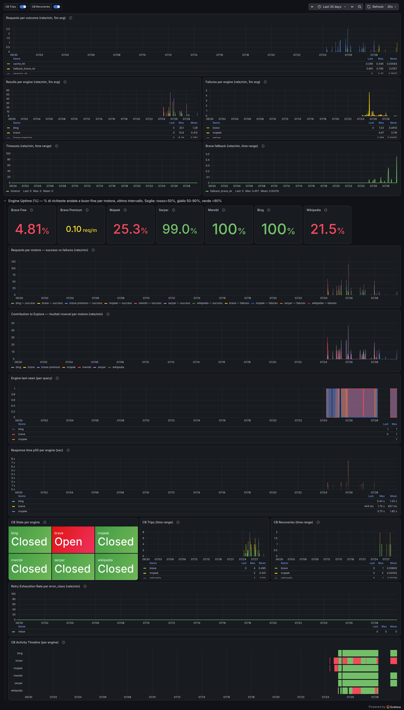
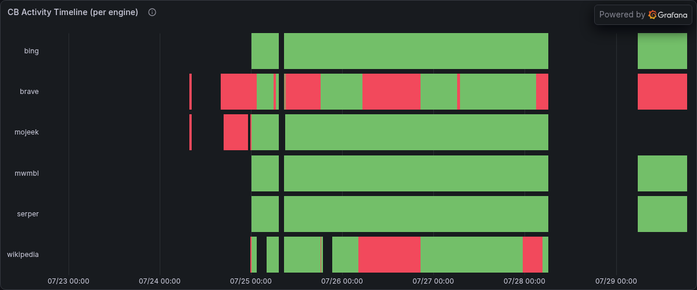
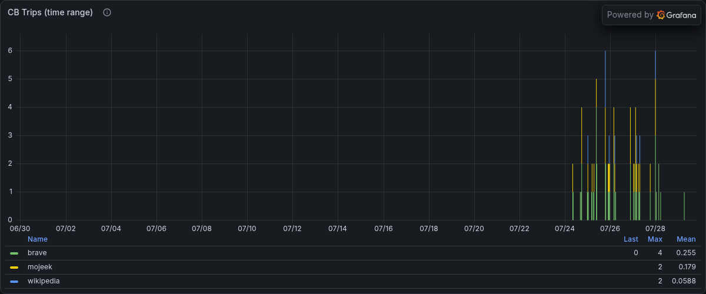
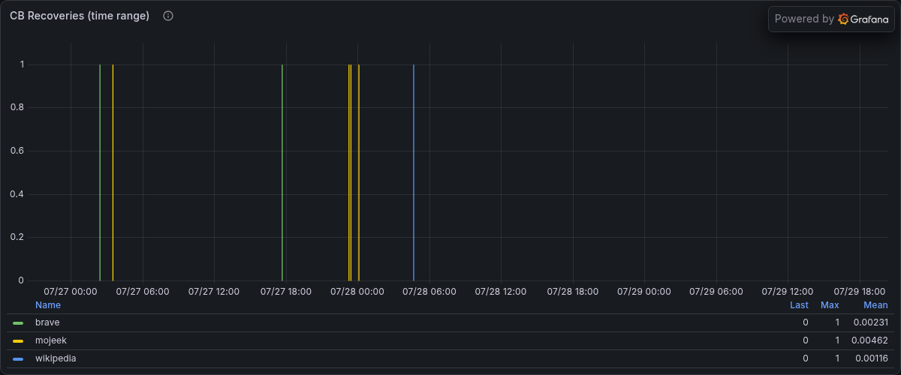

# searxng-gateway

Decision proxy in front of SearXNG: **speculative execution** — calls SearXNG and N premium providers (Brave, Exa, Jina, Tavily) in parallel via round-robin, merges results with URL dedup, and loops through remaining providers until a configurable threshold is met or timeout expires. Same JSON shape as SearXNG, Prometheus /metrics, in-memory LRU cache.

🚀 **Works with zero API keys in keyless mode.** See [docs/keyless.md](docs/keyless.md).

Originally derived from [sx](https://github.com/byteowlz/sx); adds HTTP server, per-engine circuit breaker, Prometheus metrics, cache, and Docker packaging.

## Quick Start

```bash
# 1. Clone
git clone https://github.com/Ghilteras/searxng-gateway.git
cd searxng-gateway

# 2. (Optional) Create .env with API keys — or skip for keyless mode
echo 'BRAVE_API_KEY=your_key' > .env
echo 'SERPER_API_KEY=your_key' >> .env

# 3. Start
docker compose -f docker-compose.example.yml up -d

# 4. Test
curl 'http://localhost:8080/search?q=hello+world&format=json'
curl 'http://localhost:8080/metrics'
```

## Architecture

```
Client ───▶ searxng-gateway (:8080) ───▶ SearXNG (Tier 1 free engines)
                    │                        │
                    │  ┌─────────────────────┤
                    │  │ Speculative execution│
                    │  │ (parallel round-robin)│
                    │  └─────────────────────┤
                    │                        ├── Serper (Google via API)
                    │                        ├── Bing, Wikipedia, GitHub...
                    │                        └── Circuit breaker per engine
                    │
                    └──▶ Tier 2 hot path (T1_PREMIUM_COUNT providers)
                    │    ├── Brave ──┐
                    │    ├── Exa     ├── round-robin, run in parallel
                    │    ├── Jina    │   with SearXNG. Dedup URL.
                    │    └── Tavily ─┘
                    │
                    └──▶ Fallback loop (if merged < SUFFICIENT_MIN_RESULTS)
                         Round-robin through remaining Tier 2 providers
                         until threshold, exhaustion, or FALLBACK_TIMEOUT
```

See [docs/architecture.md](docs/architecture.md) for the full design.

## Supported fallback providers

Set `FALLBACK_PROVIDERS` to a comma-separated list of premium backend names. Each needs its `_API_KEY` env var. **`T1_PREMIUM_COUNT` controls how many of them run alongside SearXNG in every request** (round-robin selection); the rest are used in the fallback loop when the merged result count is below `SUFFICIENT_MIN_RESULTS`.

| Provider | Env var | Free tier | Production |
|----------|---------|-----------|------------|
| Brave | `BRAVE_API_KEY` | $5 credit (1,000/mo) | ✅ Yes |
| Exa | `EXA_API_KEY` | $20 + $10/mo (~2,800 searches) | ✅ Yes |
| Jina | `JINA_API_KEY` | 10M tokens, 500 RPM | ✅ Yes |
| Tavily | `TAVILY_API_KEY` | 1,000 credits/mo | ✅ Yes |
| Bing | (keyless) | Free | ❌ Not deployed |

Example:
```bash
FALLBACK_PROVIDERS=brave,exa,jina
BRAVE_API_KEY=xxx
EXA_API_KEY=xxx
JINA_API_KEY=xxx
```

Keyless mode (no API keys) works out of the box using SearXNG's free engines (Bing, Wikipedia, GitHub, etc.). Premium providers require their respective API keys.

## Features

- **Speculative execution** — `T1_PREMIUM_COUNT` premium providers called in parallel with SearXNG every request, via atomic round-robin. Results merged and deduplicated by URL.
- **Bounded fallback loop** — if merged results < `SUFFICIENT_MIN_RESULTS`, remaining Tier 2 providers are tried via round-robin until threshold, exhaustion, or `FALLBACK_TIMEOUT_SECONDS`.
- **Circuit breaker per engine** — 4xx on an engine opens the circuit for 5 min; auto-recovers
- **Exponential backoff retry** — 3 retries with 1s/2s/4s backoff on 5xx/timeout
- **Prometheus /metrics** — 15+ gauges and counters prefixed `searxng_gateway_`
- **LRU cache** — 1000 entries, 1h TTL, in-memory
- **SearXNG config tuning** — reference `examples/searxng/` with engine selection, `suspended_times` tuning, custom User-Agent, and custom Python engines (Serper, Mojeek)
- **Fallback billing alert** — `engine_results_total` tracks premium API usage so you can alert before hitting quota limits

## Observability

The gateway exposes Prometheus metrics at `:8080/metrics`.

### Grafana dashboard



*A reference dashboard is included at `examples/grafana/searxng-gateway-dashboard.json`. Import it into Grafana, select your Prometheus datasource, and you'll see:*

#### Circuit Breaker State (per engine)



*Each engine gets its own row. 🟢 Closed → 🟡 Half-Open → 🔴 Open. When an engine returns 4xx, the circuit opens for 5 minutes, then auto-recovers.*

#### Circuit Breaker Trips (cumulative)



*Each trip means the gateway caught a 4xx and opened the circuit before the engine could degrade further queries. Colored by reason: `rate_limited`, `access_denied`, `captcha`.*

#### Circuit Breaker Recoveries (auto-healing)



*After 5 minutes of cooldown, the gateway probes the engine. If it responds, the circuit closes and a recovery is recorded.*

### Alerting

Example Prometheus alert rules (vmalert/Mimir compatible):

```yaml
groups:
  - name: searxng-gateway
    rules:
      - alert: SearxngCBStuckOpen
        expr: searxng_gateway_circuit_breaker_state == 2
        for: 5m
        annotations:
          summary: "Circuit breaker stuck open for engine {{ $labels.engine }}"
          
      - alert: SearxngRetryExhausted
        expr: rate(searxng_gateway_retry_exhausted_total[5m]) > 0.01
        for: 5m
        annotations:
          summary: "Retry exhaustion rate elevated"
          
      - alert: FallbackBillSpike
        expr: rate(searxng_gateway_engine_results_total[1h]) * 3600 > 100
        for: 10m
        annotations:
          summary: "Fallback API usage > 100 calls/hour — check billing"
```

## Endpoints

- `GET /search?q=<query>&format=json` — proxy endpoint
- `GET /healthz` — liveness
- `GET /metrics` — Prometheus exposition

## Env vars

| Var | Default | Required | Description |
|-----|---------|----------|-------------|
| `LISTEN_ADDR` | `:8080` | no | HTTP listen address |
| `SEARXNG_BACKEND_URL` | `http://searxng-primary:8080` | no | SearXNG instance URL |
| `FALLBACK_PROVIDERS` | `brave` | no | Comma-separated list of premium provider names |
| `BRAVE_API_KEY` | — | no | Brave Search API key |
| `SUFFICIENT_MIN_RESULTS` | `1` | no | Target merged result count; loop stops when reached (recommend 10 with premiums) |
| `T1_PREMIUM_COUNT` | `0` | no | Number of premium providers to call in parallel with SearXNG (0 = none) |
| `FALLBACK_TIMEOUT_SECONDS` | `30` | no | Maximum time for speculative execution + fallback loop |
| `SEARXNG_TIMEOUT_SECONDS` | `25` | no | Per-request timeout for SearXNG |
| `SEARXNG_FAIL_THRESHOLD` | `6` | no | Consecutive SearXNG failures before cooldown |
| `SEARXNG_FAIL_COOLDOWN_SECONDS` | `180` | no | Cooldown duration for SearXNG (seconds) |
| `BRAVE_FAIL_THRESHOLD` | `3` | no | Consecutive Brave failures before cooldown |
| `BRAVE_FAIL_COOLDOWN_SECONDS` | `300` | no | Cooldown duration for Brave (seconds) |
| `BRAVE_TIMEOUT_SECONDS` | `15` | no | Per-request timeout for Brave API |
| `CACHE_SIZE` | `1000` | no | LRU cache entries (in-memory) |
| `CACHE_TTL_SECONDS` | `3600` | no | Cache entry TTL (seconds) |
| `LOG_LEVEL` | `info` | no | Log level (debug, info, warn, error) |
| `METRICS_PATH` | `/metrics` | no | Prometheus metrics endpoint path |

### Adding a new provider

Implement the `SearchBackend` interface in `backends/`:

```go
type MyProvider struct { APIKey string; Timeout time.Duration }

func (m *MyProvider) Name() string { return "myprovider" }
func (m *MyProvider) IsAvailable() bool { return m.APIKey != "" }
func (m *MyProvider) Search(opts SearchOptions) ([]SearchResult, error) { /* ... */ }
```

Then add a case to `backends/factory.go` and set `MYPROVIDER_API_KEY` in the environment. The rest (registry, fallback chain, circuit breaker) is automatic.

## Reference deployment

- `docker-compose.example.yml` — SearXNG + gateway, one command
- `examples/searxng/` — reference SearXNG config with multi-tier engine posture
- `examples/searxng-engines/` — custom SearXNG engines (Serper, Mojeek API)
- `docs/architecture.md` — design decisions, circuit breaker, metrics
- `docs/keyless.md` — how to run without any API keys

## Build

```bash
docker buildx build --platform linux/amd64,linux/arm64 \
  -t ghcr.io/ghilteras/searxng-gateway:latest --push .
```

## License

MIT — see [LICENSE](LICENSE).
