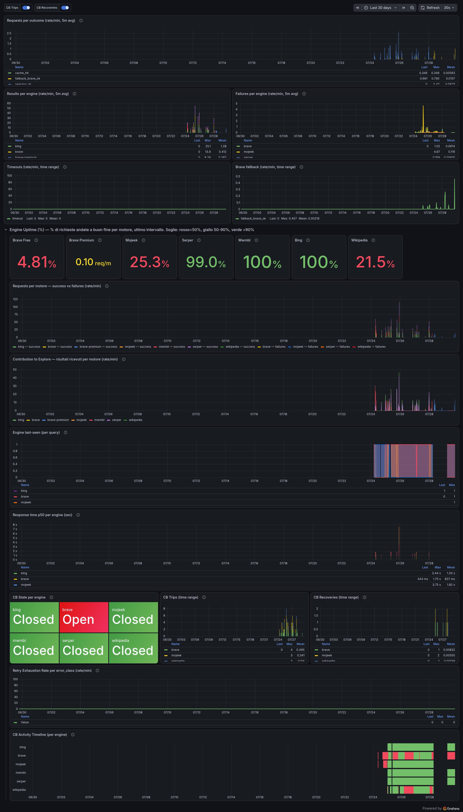
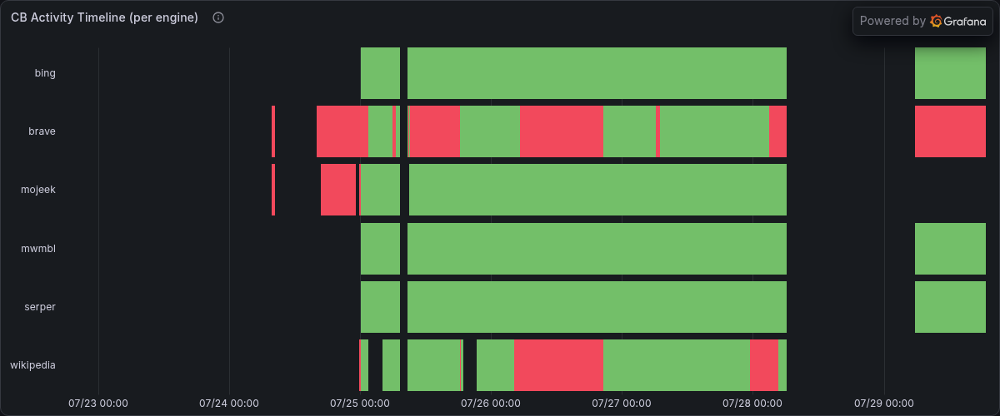
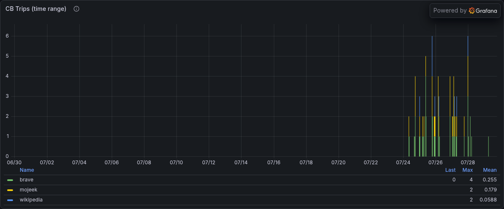
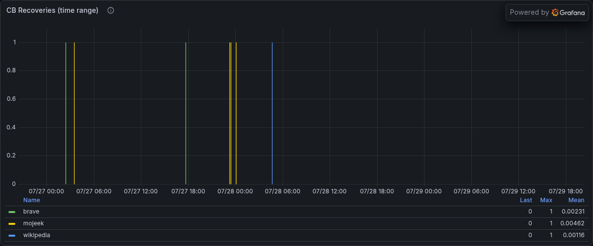
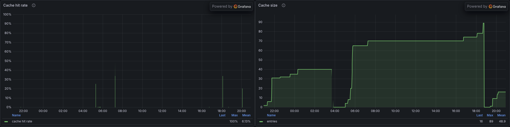

# searxng-gateway

Decision proxy in front of SearXNG: **premium-first execution** — runs the configured premium providers serially via round-robin until a configurable distinct-URL target is met, and only on shortfall falls back to a bounded SearXNG secondary stage; results are merged with URL dedup (premium wins duplicate URLs), and accumulated non-empty results are returned even below target. Same JSON shape as SearXNG, Prometheus /metrics, in-memory LRU cache.

🚀 **Works with zero API keys in keyless mode.** See [docs/keyless.md](docs/keyless.md).

Originally derived from [sx](https://github.com/byteowlz/sx); adds HTTP server, per-engine circuit breaker, Prometheus metrics, cache, and Docker packaging.

## Quick Start

```bash
# 1. Clone
git clone https://github.com/Ghilteras/searxng-gateway.git
cd searxng-gateway

# 2. (Optional) Create .env with API keys — or skip for keyless mode
echo 'BRAVE_API_KEY=your_key' > .env
echo 'SERPER_API_KEY=your_key' >> .env

# 3. Start
docker compose -f docker-compose.example.yml up -d

# 4. Test
curl 'http://localhost:8080/search?q=hello+world&format=json'
curl 'http://localhost:8080/metrics'
```

## Architecture

```
Client ───▶ searxng-gateway (:8080)
                    │
                    └──▶ PRIMARY: premium providers (FALLBACK_PROVIDERS)
                    │    ├── Brave ──┐
                    │    ├── Exa     ├── round-robin, serial within the stage;
                    │    ├── Jina    │   stops when the target is reached.
                    │    └── Tavily ─┘
                    │
                    └──▶ SECONDARY: SearXNG (only on shortfall, bounded)
                         ├── Serper (Google via API)
                         ├── Bing, Wikipedia, GitHub...
                         └── Circuit breaker per engine + cooldown
                         Retry (network-class) up to 3 attempts within
                         SEARXNG_TIMEOUT_SECONDS; merged after premium results.
```

See [docs/architecture.md](docs/architecture.md) for the full design.

## Supported fallback providers

Set `FALLBACK_PROVIDERS` to a comma-separated list of premium backend names. Each needs its `_API_KEY` env var. The premium providers run first, serially via round-robin, until the accumulated distinct-URL count reaches `SUFFICIENT_MIN_RESULTS` (or all providers are tried, or the premium budget expires). SearXNG is only called as a bounded secondary when the premium stage falls short.

| Provider | Env var | Free tier | Production |
|----------|---------|-----------|------------|
| Brave | `BRAVE_API_KEY` | $5 credit (1,000/mo) | ✅ Yes |
| Exa | `EXA_API_KEY` | $20 + $10/mo (~2,800 searches) | ✅ Yes |
| Jina | `JINA_API_KEY` | 10M tokens, 500 RPM | ✅ Yes |
| Tavily | `TAVILY_API_KEY` | 1,000 credits/mo | ✅ Yes |

Example:
```bash
FALLBACK_PROVIDERS=brave,exa,jina
BRAVE_API_KEY=xxx
EXA_API_KEY=xxx
JINA_API_KEY=xxx
```

Keyless mode (no API keys) works out of the box using SearXNG's free engines (Bing, Wikipedia, GitHub, etc.). Premium providers require their respective API keys.

## Features

- **Premium-first execution** — the configured premium providers are selected via atomic round-robin and invoked **serially** (by deliberate design; see [docs/architecture.md](docs/architecture.md#why-the-premium-pass-is-serial-deliberate)) until the distinct-URL target is met. SearXNG runs only as a bounded secondary on shortfall, and its results are merged after the premium results (premium wins duplicate URLs).
- **Bounded SearXNG secondary** — if the premium stage falls short of `SUFFICIENT_MIN_RESULTS`, SearXNG is called within the remaining `FALLBACK_TIMEOUT_SECONDS` budget (capped at `SEARXNG_TIMEOUT_SECONDS`) with retry and cooldown; its results are merged after the premium results.
- **Circuit breaker per provider/engine** — premium provider faults and SearXNG engine client errors open their circuit for 5 min; auto-recovers
- **Exponential backoff retry** — up to 3 attempts (250ms/500ms between attempts), bounded by the SearXNG stage budget
- **Prometheus /metrics** — 15+ gauges and counters prefixed `searxng_gateway_`
- **LRU cache** — 1000 entries, 1h TTL, in-memory
- **SearXNG config tuning** — reference `examples/searxng/` with engine selection, `suspended_times` tuning, custom User-Agent, and custom Python engines (Serper, Mojeek)
- **Fallback billing alert** — `engine_results_total` tracks premium API usage so you can alert before hitting quota limits

## Observability

The gateway exposes Prometheus metrics at `:8080/metrics`.

### Grafana dashboard



*A reference dashboard is included at `examples/grafana/searxng-gateway-dashboard.json`. Import it into Grafana, select your Prometheus datasource, and you'll see:*

#### Circuit Breaker State (per engine)



*Each circuit gets its own row. Premium circuits use `premium:<provider>` identities and open on genuine provider faults; SearXNG engine circuits open on reported client errors. 🟢 Closed → 🟡 Half-Open → 🔴 Open. After 5 minutes, exactly one real provider probe is admitted; success closes the circuit and failure reopens it.*

#### Circuit Breaker Trips (cumulative)



*Each trip means the gateway caught a 4xx and opened the circuit before the engine could degrade further queries. Colored by reason: `rate_limited`, `access_denied`, `captcha`.*

#### Circuit Breaker Recoveries (auto-healing)



*After 5 minutes of cooldown, the gateway probes the engine. If it responds, the circuit closes and a recovery is recorded.*

#### Cache hit rate & Cache size



*Repeated queries are served from the in-memory LRU cache (1000 entries, 1h TTL). "Cache hit rate" is the percentage of requests answered from cache (`100 * rate(cache_hit) / rate(total)`); "Cache size" tracks the current entry count. A low hit rate means every query is hitting SearXNG and premium providers — tune `CACHE_SIZE`/`CACHE_TTL_SECONDS` accordingly.*

### Alerting

Example Prometheus alert rules (vmalert/Mimir compatible):

```yaml
groups:
  - name: searxng-gateway
    rules:
      - alert: SearxngCBStuckOpen
        expr: searxng_gateway_circuit_breaker_state == 2
        for: 5m
        annotations:
          summary: "Circuit breaker stuck open for engine {{ $labels.engine }}"
          
      - alert: SearxngRetryExhausted
        expr: rate(searxng_gateway_retry_exhausted_total[5m]) > 0.01
        for: 5m
        annotations:
          summary: "Retry exhaustion rate elevated"
          
      - alert: FallbackBillSpike
        expr: rate(searxng_gateway_engine_results_total[1h]) * 3600 > 100
        for: 10m
        annotations:
          summary: "Fallback API usage > 100 calls/hour — check billing"
```

## Endpoints

- `GET /search?q=<query>&format=json` — proxy endpoint
- `GET /healthz` — liveness
- `GET /metrics` — Prometheus exposition

## Env vars

| Var | Default | Required | Description |
|-----|---------|----------|-------------|
| `LISTEN_ADDR` | `:8080` | no | HTTP listen address |
| `SEARXNG_BACKEND_URL` | `http://searxng-primary:8080` | no | SearXNG instance URL |
| `FALLBACK_PROVIDERS` | `brave` | no | Comma-separated list of premium provider names |
| `BRAVE_API_KEY` | — | no | Brave Search API key |
| `EXA_API_KEY` | — | no | Exa Search API key |
| `JINA_API_KEY` | — | no | Jina Search API key |
| `TAVILY_API_KEY` | — | no | Tavily Search API key |
| `SUFFICIENT_MIN_RESULTS` | `1` | no | Target distinct-URL result count; loop stops when reached (recommend 10 with premiums) |
| `FALLBACK_TIMEOUT_SECONDS` | `8` | no | Hard total request budget: the premium-first stage plus the bounded SearXNG secondary; accumulated nonempty results are returned at the deadline |
| `SEARXNG_TIMEOUT_SECONDS` | `3` | no | Total SearXNG stage budget shared by the HTTP request and all retries/backoff; the stage is cancelled when it expires. A stage expiry while the parent request budget is still alive counts as a SearXNG failure; a parent-budget expiry or caller cancellation does not |
| `SEARXNG_FAIL_THRESHOLD` | `6` | no | Consecutive SearXNG failures before cooldown |
| `SEARXNG_FAIL_COOLDOWN_SECONDS` | `180` | no | Cooldown duration for SearXNG (seconds) |
| `BRAVE_FAIL_THRESHOLD` | `3` | no | Consecutive Brave failures before cooldown |
| `BRAVE_FAIL_COOLDOWN_SECONDS` | `300` | no | Cooldown duration for Brave (seconds) |
| `BRAVE_TIMEOUT_SECONDS` | `3` | no | Per-request timeout applied to every configured premium provider (legacy variable name) |
| `OTEL_TRACES_EXPORTER` | *(empty)* | no | Tracing off. Set `console` or `otlp` to enable OpenTelemetry tracing |
| `OTEL_EXPORTER_OTLP_ENDPOINT` | *(empty)* | no | OTLP/HTTP base endpoint; `/v1/traces` is appended. Required when the exporter is `otlp` |
| `OTEL_EXPORTER_OTLP_TRACES_ENDPOINT` | *(empty)* | no | Trace-specific OTLP endpoint, used verbatim; takes precedence over the generic one |
| `OTEL_TRACES_SAMPLER_ARG` | `0.1` | no | Trace-ID ratio sampler (`0`–`1`); an incoming sampled flag cannot override it |
| `OTEL_SERVICE_NAME` | `searxng-gateway` | no | Resource `service.name` for exported spans |
| `OTEL_RESOURCE_ATTRIBUTES` | *(empty)* | no | Extra standard resource attributes, e.g. `deployment.environment=homelab` |
| `CACHE_SIZE` | `1000` | no | LRU cache entries (in-memory) |
| `CACHE_TTL_SECONDS` | `3600` | no | Cache entry TTL (seconds) |
| `LOG_LEVEL` | `info` | no | Log level (debug, info, warn, error) |
| `METRICS_PATH` | `/metrics` | no | Prometheus metrics endpoint path |

### Adding a new provider

Implement the `SearchBackend` interface in `backends/`:

```go
type MyProvider struct { APIKey string; Timeout time.Duration }

func (m *MyProvider) Name() string { return "myprovider" }
func (m *MyProvider) IsAvailable() bool { return m.APIKey != "" }
func (m *MyProvider) Search(opts SearchOptions) ([]SearchResult, error) {
	ctx := opts.Context
	if ctx == nil {
		ctx = context.Background()
	}
	req, err := http.NewRequestWithContext(ctx, http.MethodGet, "https://example.test/search", nil)
	if err != nil {
		return nil, err
	}
	// Execute req with an HTTP client and map the response to SearchResult values.
	return nil, nil
}
```

Provider implementations must pass `opts.Context` to outbound requests so gateway cancellation and the total response deadline stop upstream work.

Then add a case to `backends/factory.go` and set `MYPROVIDER_API_KEY` in the environment. The rest (registry, fallback chain, circuit breaker) is automatic.

## Reference deployment

- `docker-compose.example.yml` — SearXNG + gateway, one command
- `examples/searxng/` — reference SearXNG config with multi-tier engine posture
- `examples/searxng-engines/` — custom SearXNG engines (Serper, Mojeek API)
- `docs/architecture.md` — design decisions, circuit breaker, metrics
- `docs/keyless.md` — how to run without any API keys

## Build

The image is built and pushed automatically by **GitHub Actions** on every push to `main` and on `v*` tags: see [`.github/workflows/build.yml`](.github/workflows/build.yml) (`docker/build-push-action@v6`, platforms `linux/amd64,linux/arm64`, gha cache, push to GHCR). No local multi-arch build needed — the local `multiarch` buildx builder was removed from the homelab (2026-08-04).

## License

MIT — see [LICENSE](LICENSE).
